<div align="center">

# ⚡ fastcma

**Hyper-optimized CMA-ES in Rust with a first-class Python experience**

[](https://github.com/Dicklesworthstone/fast_cmaes/actions/workflows/build-wheels.yml)
[](https://pypi.org/project/fast-cmaes/)
[](https://www.python.org/)
[](https://www.rust-lang.org/)
[](LICENSE)

---

**SIMD** • **rayon** • **deterministic seeds** • **vectorized objectives** • **restarts** • **constraints** • **Rich TUI**

Published to PyPI as [`fast-cmaes`](https://pypi.org/project/fast-cmaes/) (module name: `fastcma`). Latest release: **v0.1.4**

</div>

## 📑 Table of Contents

- [Why CMA-ES](#-why-cma-es)
- [Architecture](#-architecture)
- [Features](#-features)
- [Installation](#-installation-python)
- [Quickstart](#-quickstart-python)
- [Vectorized & Constraints](#-vectorized--constraints)
- [Rust Usage](#-rust-usage-library)
- [C/C++ FFI](#-cc-ffi)
- [REST API](#-rest-api-example)
- [Demos & TUI](#-demos--visualization)
- [Baselines & Benchmarks](#-baselines--benchmarks)
- [Performance](#-performance-considerations)
- [Feature Flags](#-feature-flags)
- [Testing](#-testing)
- [License](#-license)

## 🎯 Why CMA-ES

<div align="center">

**Derivative-free** • **Adaptive** • **Parallel-friendly**

</div>

CMA-ES (Covariance Matrix Adaptation Evolution Strategy) represents a paradigm shift in optimization. Invented by Nikolaus Hansen in 1996, CMA-ES emerged from decades of research into evolution strategies and has since become one of the most successful derivative-free optimization algorithms. Hansen, who continues to research and refine CMA-ES along with other evolutionary algorithms, developed the method to address fundamental limitations in existing optimization techniques. Unlike gradient-based methods that require smooth, differentiable objectives, CMA-ES thrives on black-box problems where gradients are unavailable, noisy, or meaningless. The algorithm automatically adapts its search distribution by learning the problem's structure through successful search directions, making it particularly effective for non-convex landscapes with curved valleys and deceptive local minima.

The core strength lies in its adaptive mechanisms. The step size $$\sigma$$ controls exploration radius, while the covariance matrix $$\mathbf{C}$$ shapes the search distribution to follow favorable directions. This dual adaptation allows CMA-ES to navigate complex fitness landscapes that would trap simpler optimizers. Moreover, the population-based approach means candidate evaluations are embarrassingly parallel, enabling near-linear speedup with additional CPU cores. Over nearly three decades of development, CMA-ES has evolved from a research prototype into a mature, production-ready algorithm with proven effectiveness across diverse application domains.

**Key Advantages:**

| Feature | Benefit |
|---------|---------|
| **No gradients required** | Works with black-box, noisy, or discontinuous objectives |
| **Adaptive step size** | Automatically balances exploration vs exploitation |
| **Covariance adaptation** | Learns problem structure and follows favorable search directions |
| **Population-based** | Naturally parallelizable, robust to local minima |

## 🏗️ Architecture


### Architecture Deep Dive

#### Core Components

**1. Ask-Tell Interface (`CmaesState`)**

The optimizer follows the classic CMA-ES ask-tell pattern:

```mermaid
flowchart TD
    Start([Start]) --> Init[Init xmean, σ, C]
    Init --> Ask[ask: Generate λ]
    Ask --> Eval[Evaluate fitness]
    Eval --> Tell[tell: Update]
    Tell --> UpdateMean[Update xmean]
    UpdateMean --> UpdateCov[Update C]
    UpdateCov --> UpdateSigma[Adapt σ]
    UpdateSigma --> CheckTerm{Done?}
    CheckTerm -->|No| Ask
    CheckTerm -->|Yes| End([Return])
    
    classDef askStyle fill:#b3d9ff,stroke:#7fb3d3,stroke-width:1px,color:#333
    classDef tellStyle fill:#b3e5d1,stroke:#7fb8a3,stroke-width:1px,color:#333
    classDef decisionStyle fill:#ffe0b3,stroke:#ffcc80,stroke-width:1px,color:#333
    classDef startEndStyle fill:#e1bee7,stroke:#ce93d8,stroke-width:1px,color:#333
    
    class Ask,Eval askStyle
    class Tell,UpdateMean,UpdateCov,UpdateSigma tellStyle
    class CheckTerm decisionStyle
    class Start,End startEndStyle
```



**Mathematical Formulation:**

- **`ask()`**: Generates $$\lambda$$ candidate solutions by sampling:

  $$x_i \sim \mathcal{N}(\mathbf{x}_{\mathrm{mean}}, \sigma^2 \mathbf{C})$$

  **What this means:** We create new candidate solutions by drawing from a multivariate normal distribution centered at the current best estimate ($$\mathbf{x}_{\mathrm{mean}}$$), with spread controlled by the step size $$\sigma$$ and shape determined by the covariance matrix $$\mathbf{C}$$. Think of this as generating "guesses" around our current best point, where the covariance matrix learns the shape of the problem landscape.

  **Why this matters:** Instead of randomly searching everywhere, CMA-ES learns the "direction" and "shape" of good solutions through the covariance matrix, making each generation of candidates smarter than the last.

- **`tell()`**: Updates distribution parameters:
  - **Weighted mean**:

    $$\mathbf{x}_{\mathrm{mean}} \leftarrow \sum_{i=1}^{\mu} w_i \mathbf{x}_{i:\lambda}$$

    **What this means:** We update our search center by taking a weighted average of the best $$\mu$$ solutions from the current generation. Better solutions get higher weights ($$w_i$$), so the center moves toward promising regions.

    **Why this matters:** Instead of jumping to the single best solution, we take an "elite average" that reduces noise and provides a more stable search direction.

  - **Evolution paths**:

    $$\mathbf{p}_c \leftarrow (1-c_c)\mathbf{p}_c + c_c h_{\sigma} \frac{\mathbf{x}_{\mathrm{mean}} - \mathbf{x}_{\mathrm{old}}}{\sigma}$$

    $$\mathbf{p}_{\sigma} \leftarrow (1-c_{\sigma})\mathbf{p}_{\sigma} + c_{\sigma} \frac{\mathbf{C}^{-1/2}(\mathbf{x}_{\mathrm{mean}} - \mathbf{x}_{\mathrm{old}})}{\sigma}$$

    **What this means:** Evolution paths track the direction of recent progress. $$\mathbf{p}_c$$ remembers successful moves (for covariance adaptation), while $$\mathbf{p}_{\sigma}$$ monitors step size effectiveness. The $$h_{\sigma}$$ term prevents updates when steps are too small.

    **Why this matters:** These "memory" vectors help the algorithm distinguish between random fluctuations and genuine progress, enabling smarter adaptation of both search direction and step size.

  - **Covariance update**:

    $$\mathbf{C} \leftarrow (1-c_1-c_{\mu})\mathbf{C} + c_1 \mathbf{p}_c \mathbf{p}_c^T + c_{\mu} \sum_{i=1}^{\mu} w_i \mathbf{y}_{i:\lambda} \mathbf{y}_{i:\lambda}^T$$

    **What this means:** The covariance matrix evolves through three parts: (1) gradual forgetting of old information, (2) learning from the evolution path direction, and (3) incorporating successful steps from the current population. $$\mathbf{y}_{i:\lambda}$$ are the steps taken relative to the mean.

    **Why this matters:** This is how CMA-ES "learns" the shape of the problem. If good solutions consistently lie along certain directions, the covariance matrix stretches the search distribution in those directions.

  - **Step size adaptation**:

    $$\sigma \leftarrow \sigma \exp\left(\frac{c_{\sigma}}{d_{\sigma}}\left(\frac{\|\mathbf{p}_{\sigma}\|}{\mathbb{E}[\|\mathcal{N}(\mathbf{0},\mathbf{I})\|]} - 1\right)\right)$$

    **What this means:** The step size increases when the evolution path is longer than expected (indicating good progress) and decreases when it's shorter (indicating stagnation). The expected length comes from a standard normal distribution.

    **Why this matters:** This automatic step size control prevents the algorithm from taking steps that are too large (missing optima) or too small (wasting evaluations), maintaining an optimal balance between exploration and exploitation.

**2. Covariance Representation (`CovarianceMode`)**

Two modes optimize for different problem characteristics:

```mermaid
flowchart TD
    Start([Mode Selection]) --> CheckDim{n < 50?}
    CheckDim -->|Yes| Full["Full: n×n, O(n^3)"]
    CheckDim -->|No| Diag["Diagonal: n, O(n)"]
    
    Full --> FullUse["Correlations, curved valleys"]
    Diag --> DiagUse["Fast, separable"]
    
    classDef fullStyle fill:#b3d9ff,stroke:#7fb3d3,stroke-width:1px,color:#333
    classDef diagStyle fill:#b3e5d1,stroke:#7fb8a3,stroke-width:1px,color:#333
    classDef decisionStyle fill:#ffe0b3,stroke:#ffcc80,stroke-width:1px,color:#333
    
    class Full,FullUse fullStyle
    class Diag,DiagUse diagStyle
    class CheckDim decisionStyle
```



**Mathematical Formulation:**

The choice between full and diagonal covariance represents a fundamental trade-off between modeling accuracy and computational cost. Full covariance stores the complete $$n \times n$$ matrix $$\mathbf{C}$$, enabling adaptation to arbitrary search distributions and capturing correlations between variables. This comes at the cost of $$O(n^3)$$ eigen decomposition for sampling, making it best suited for low-to-medium dimensions where correlations significantly impact optimization.

Diagonal covariance takes a pragmatic approach, storing only the $$n$$ diagonal elements and assuming variable independence. This reduces storage from $$O(n^2)$$ to $$O(n)$$ and eliminates the expensive eigen decomposition, trading correlation modeling for speed. The diagonal mode excels on separable problems where variables can be optimized independently, or in high dimensions where full covariance becomes computationally prohibitive.

**Covariance Mode Comparison:**

| Aspect | Full Covariance | Diagonal Covariance |
|--------|----------------|---------------------|
| **Storage** | $$O(n^2)$$ | $$O(n)$$ |
| **Sampling cost** | $$O(n^3)$$ eigen decomposition | $$O(n)$$ element-wise |
| **Correlation modeling** | Captures all pairwise correlations | Assumes independence |
| **Best for** | Low-medium dimensions (< 50), correlated variables | High dimensions (> 50), separable problems |
| **Convergence quality** | Higher (adapts to problem structure) | Lower (but often sufficient) |
| **Speed** | Slower (eigen decomposition bottleneck) | Faster (linear scaling) |

**Covariance Update Process:**

The covariance matrix evolves through a combination of rank-one and rank-μ updates:

$$\mathbf{C} \leftarrow (1-c_1-c_{\mu})\mathbf{C} + c_1 \mathbf{p}_c \mathbf{p}_c^T + c_{\mu} \sum_{i=1}^{\mu} w_i \mathbf{y}_{i:\lambda} \mathbf{y}_{i:\lambda}^T$$

The first term decays the current covariance, preventing it from growing unbounded. The second term incorporates the evolution path $$\mathbf{p}_c$$, capturing the direction of recent successful steps. The third term aggregates information from the current population, with weights $$w_i$$ emphasizing better solutions. This dual mechanism combines short-term momentum (evolution path) with long-term learning (population statistics), enabling robust adaptation to diverse problem landscapes.

**3. Parameter Adaptation**
- **Cumulative step-size adaptation**: Evolution path `ps` tracks the direction of recent steps, enabling faster convergence along favorable directions
- **Cumulative covariance adaptation**: Evolution path `pc` accumulates successful search directions, shaping the covariance matrix
- **Rank-μ and rank-one updates**: Combines information from the current population (rank-μ) and the evolution path (rank-one) for robust covariance adaptation

#### Performance Optimizations

**Optimization Strategy Overview:**


**1. SIMD-Accelerated Dot Products**
```rust
// Uses portable_simd with 4 f64 lanes (256-bit AVX on x86_64)
fn dot_simd(a: &[f64], b: &[f64]) -> f64
```
- Processes 4 elements per iteration using SIMD instructions
- Falls back to scalar for remainder elements
- Used in Mahalanobis norm computation, square sums, and constraint clamping
- **Impact**: ~3-4x speedup on dot products compared to naive scalar loops

**2. Lazy Eigensystem Updates**

The most expensive operation ($$O(n^3)$$ eigen decomposition) is deferred using an adaptive gap:

$$\mathrm{lazy\_gap\_evals} = \frac{0.5 \cdot n \cdot \lambda}{(c_1 + c_{\mu}) \cdot n^2}$$

**What this means:** This formula calculates how long we can wait before recomputing the expensive eigen decomposition. The gap grows with problem dimension ($$n$$), population size ($$\lambda$$), and learning rates ($$c_1, c_{\mu}$$), but shrinks relative to the cost of the decomposition ($$n^2$$).

**Why this matters:** Eigen decomposition can be 90% of runtime in high dimensions, but the eigenvectors change slowly. This optimization defers the expensive computation until it's actually needed, reducing it by 5-10x in typical runs.


- Eigensystem only recomputed when $$\mathrm{current\_eval} > \mathrm{updated\_eval} + \mathrm{lazy\_gap\_evals}$$
- Gap grows with dimension and learning rates, naturally reducing update frequency
- Covariance matrix updates continue (cheap rank-one/rank-μ), but sampling uses cached eigenbasis
- **Impact**: Reduces eigen decompositions by 5-10x in typical runs, critical for high-dimensional problems

**3. Rayon Parallelization**
- **Fitness evaluation**: `x_candidates.par_iter().map(|x| objective(x))` parallelizes embarrassingly parallel objective calls
- **Covariance updates**: `data.par_chunks_mut(n).for_each(...)` parallelizes outer product accumulation
- **Impact**: Near-linear speedup with CPU cores (e.g., 8 cores → ~7x faster on parallelizable objectives)

**4. Pre-allocated Buffers**
Reusable scratch buffers (`z_buf`, `y_buf`, `tmp_buf`) eliminate allocations in hot paths:
- `z_buf`: Standard normal samples in eigenbasis space
- `y_buf`: Transformed samples in original space
- `tmp_buf`: Temporary storage for matrix-vector operations
- **Impact**: Zero-allocation inner loops, critical for low-latency applications

**5. Symmetry Enforcement**
Covariance matrices must be symmetric, but floating-point updates can introduce asymmetry:
```rust
fn enforce_symmetry(&mut self) // Averages A[i,j] and A[j,i]
```
- Ensures numerical stability without expensive checks on every access
- Applied only before eigen decomposition (lazy evaluation)

#### Robustness & Reliability Features

Robustness in fastcma extends beyond handling difficult optimization problems to ensuring reliable behavior under diverse conditions. The implementation includes multiple layers of protection against common failure modes: numerical instability, noisy evaluations, invalid inputs, and infinite loops. These features work together to create a system that gracefully handles edge cases rather than crashing or producing incorrect results.

**1. Deterministic Seeding**
```rust
fn new_with_seed(..., seed: u64) -> Self {
    state.rng = StdRng::seed_from_u64(seed);
}
```
- **Why**: Enables reproducible benchmarks, regression testing, and debugging
- **Implementation**: Uses `rand::StdRng` with `SeedableRng` trait
- **Impact**: Same seed → identical optimization trajectory (critical for CI/CD and scientific reproducibility)

**2. Noise Handling**
Detects when fitness evaluations are too similar (indicating noise or stagnation):
```rust
if spread < threshold_rel {
    sigma *= sigma_expand; // Expand step size to escape
    noise_cooldown = cooldown_iters; // Prevent oscillation
}
```
- **Why**: Noisy objectives can trap CMA-ES with artificially small step sizes
- **Detection**: Compares fitness spread (`mid - best`) relative to best value
- **Response**: Temporarily expands `sigma` with cooldown to prevent thrashing
- **Impact**: Robust performance on noisy objectives (simulations, Monte Carlo, etc.)

**3. Eigenvalue Flooring**
Prevents numerical issues from negative or near-zero eigenvalues:
```rust
if min_ev <= 0.0 {
    for ev in &mut eigs {
        if *ev < eps { *ev = eps; } // Floor to 1e-20
    }
}
```
- **Why**: Negative eigenvalues break sampling; near-zero cause numerical instability
- **Impact**: Prevents panics and ensures valid covariance matrices even under numerical drift

**4. Constraint Handling Pipeline**

Multi-stage constraint satisfaction with fallback mechanisms:


**Stages:**

1. **Box projection** (SIMD-accelerated): Clamps to $$[\mathbf{lb}, \mathbf{ub}]$$ bounds

   $$x_i \leftarrow \max(\min(x_i, ub_i), lb_i)$$

   **What this means:** For each dimension, we ensure the candidate solution stays within the bounds by taking the minimum of the upper bound and maximum of the lower bound. It's like bouncing off invisible walls.

   **Why this matters:** Simple and fast way to handle box constraints without rejecting potentially good solutions that are just slightly out of bounds.

2. **Mirroring** (optional): Reflects out-of-bounds points into feasible region

   $$x_i \leftarrow \begin{cases} lb_i + (|x_i - lb_i| \bmod 2w_i) & \mathrm{if\ } (|x_i - lb_i| \bmod 2w_i) \leq w_i \\ ub_i - ((|x_i - lb_i| \bmod 2w_i) - w_i) & \mathrm{otherwise} \end{cases}$$

   where $$w_i = ub_i - lb_i$$

   **What this means:** Points that go outside bounds get "folded back" into the feasible region using modular arithmetic. It's like wrapping around the edges of the box, creating a toroidal search space.

   **Why this matters:** Instead of clamping (which can create artificial boundaries), mirroring preserves the search direction and maintains exploration near boundaries.

3. **Rejection/resampling**: Up to `max_resamples` attempts if `reject()` predicate fails

4. **Repair** (optional): User-provided function to fix infeasible points

5. **Penalty** (optional): Adds penalty to fitness for remaining violations

   $$f_{\mathrm{penalized}} = f(\mathbf{x}) + \mathrm{penalty}(\mathbf{x})$$

   **What this means:** If a solution violates constraints, we add an extra penalty term to its fitness score, making it less attractive to the optimizer. The penalty function quantifies how "bad" the constraint violation is.

   **Why this matters:** Allows CMA-ES to handle complex constraints (like nonlinear inequalities) by converting them into a modified objective function that guides search away from infeasible regions.

- **Why**: Flexible constraint handling accommodates diverse problem types
- **Impact**: Works with box constraints, nonlinear constraints (via penalty), and custom feasibility rules

**5. NaN Handling**
Robust sorting handles NaN fitness values:
```rust
match (ai.partial_cmp(&aj), ai.is_nan(), aj.is_nan()) {
    (_, true, false) => Ordering::Greater,  // NaN > valid
    (_, false, true) => Ordering::Less,     // valid < NaN
    ...
}
```
- **Why**: Invalid objective evaluations shouldn't crash the optimizer
- **Impact**: Graceful degradation when objectives return NaN/Inf

**6. Termination Conditions**
Multiple termination criteria prevent infinite loops:
- **Max evaluations**: Hard budget limit
- **Target fitness**: Early exit on convergence
- **Condition number**: Stops if covariance becomes ill-conditioned (> 1e14)
- **TolFun**: Stops if fitness improvement stalls (< 1e-12)
- **TolX**: Stops if step size becomes negligible
- **Impact**: Reliable termination under diverse conditions

#### Design Decisions & Trade-offs

Every design decision in fastcma reflects careful consideration of trade-offs between performance, usability, and maintainability. The choices prioritize practical benefits for end users while maintaining code quality and extensibility. These decisions aren't arbitrary but represent informed choices based on profiling, benchmarking, and real-world usage patterns.

**1. Rust + PyO3 vs Pure Python**

The choice to implement the core in Rust with Python bindings represents a fundamental trade-off between development complexity and runtime performance. Rust provides zero-cost abstractions that enable high-level code without runtime overhead, memory safety that prevents entire classes of bugs, and direct access to SIMD instructions for vectorization. PyO3 bridges the gap between Rust's performance and Python's ecosystem, enabling seamless integration with minimal overhead.

The trade-off manifests in build complexity: users must compile Rust code rather than simply installing Python packages. However, the performance gains justify this complexity: core operations achieve 10-100x speedups compared to pure Python implementations. The inclusion of a pure Python baseline (`fastcma_baseline`) enables direct performance comparisons, demonstrating the value of the Rust implementation.

**2. Full vs Diagonal Covariance**

Rather than forcing a single covariance representation, fastcma provides user-selectable modes that optimize for different problem characteristics. Full covariance captures all pairwise variable correlations, enabling adaptation to arbitrary search distributions, but requires $$O(n^3)$$ eigen decomposition for sampling. Diagonal covariance assumes variable independence, reducing storage to $$O(n)$$ and eliminating expensive decompositions, but sacrifices correlation modeling.

The trade-off becomes clear in high dimensions: full covariance provides better convergence quality but becomes computationally prohibitive, while diagonal covariance offers acceptable quality with dramatically better performance. By making this configurable, users can choose based on their specific problem characteristics and computational constraints.

**3. Lazy vs Eager Eigensystem Updates**

The lazy eigensystem update strategy defers expensive $$O(n^3)$$ eigen decompositions until necessary, rather than recomputing every iteration. This decision recognizes that covariance matrix updates (cheap rank-one and rank-μ operations) can proceed without immediate eigen decomposition, and the eigenbasis remains sufficiently accurate for several iterations.

The trade-off involves slightly stale eigenbasis information between updates, but the performance gain is substantial: 5-10x fewer decompositions in typical runs. The adaptive gap calculation ensures updates occur frequently enough to maintain accuracy while avoiding unnecessary computation. This optimization becomes critical for high-dimensional problems where eigen decomposition dominates runtime.

**4. Rayon vs Sequential**

The choice to use Rayon for parallelization reflects the embarrassingly parallel nature of fitness evaluation. Unlike some algorithms where parallelization introduces complexity or synchronization overhead, CMA-ES naturally parallelizes: each candidate can be evaluated independently. Rayon provides a zero-cost abstraction that automatically scales to available CPU cores.

The trade-off involves slight thread pool overhead, but this is negligible compared to the linear speedup achieved on parallelizable objectives. For expensive objective functions that dominate runtime, parallelization can reduce wall-clock time by factors matching core count, making this an essential optimization for practical applications.

**5. Deterministic vs Non-deterministic**

Deterministic seeding by default prioritizes reproducibility over slight performance gains from faster random number generators. This choice recognizes that reproducibility is essential for debugging, regression testing, and scientific validation. The performance cost is negligible: modern RNGs are fast enough that seeding overhead doesn't impact optimization runtime.

The trade-off enables reproducible benchmarks, making it possible to verify that optimizations don't regress performance and that bug fixes actually resolve issues. This determinism is critical for CI/CD pipelines and scientific reproducibility, where identical inputs must produce identical outputs.

## ✨ Features

<div align="center">

**Production-ready** • **High-performance** • **Developer-friendly**

</div>

Fastcma delivers a comprehensive optimization toolkit that balances ease of use with raw performance. The Python API provides multiple interfaces tailored to different use cases, from simple one-line optimizations to fine-grained control over the optimization process. Under the hood, a carefully optimized Rust core leverages modern CPU features like SIMD instructions and multi-core parallelism to achieve performance that rivals or exceeds hand-tuned C implementations.

### 🐍 Python API

The API design follows a progressive disclosure principle. New users can start with `fmin` for immediate results, while advanced users can leverage `fmin_vec` for batch processing, `fmin_constrained` for complex constraint handling, or the full `CMAES` class for complete control. The `fmin_restart` function implements proven IPOP and BIPOP strategies that automatically escape local minima by adaptively increasing population size.

| Function | Use Case | Complexity |
|----------|----------|------------|
| **`fmin`** | Quick optimization with minimal setup | Low |
| **`fmin_vec`** | Batch evaluation for vectorized objectives | Medium |
| **`fmin_constrained`** | Box constraints, nonlinear constraints, custom feasibility | Medium |
| **`fmin_restart`** | Escaping local minima with adaptive restarts | Medium |
| **`CMAES` class** | Full ask-tell control for custom workflows | High |

### ⚡ Performance

Performance optimization follows a multi-layered strategy. SIMD acceleration targets the most frequent operations like dot products, achieving 3-4x speedups on modern CPUs. Rayon parallelization exploits the embarrassingly parallel nature of fitness evaluation, scaling linearly with core count. The lazy eigensystem update defers expensive $$O(n^3)$$ eigen decompositions until necessary, reducing their frequency by 5-10x. Pre-allocated buffers eliminate memory allocations in hot paths, critical for low-latency applications.

| Optimization | Technique | Speedup | When It Matters |
|--------------|-----------|---------|-----------------|
| **SIMD** | Vectorized dot products | 3-4x | High-dimensional problems |
| **Rayon** | Parallel fitness evaluation | Linear with cores | Expensive objectives |
| **Lazy eigen** | Deferred decomposition | 5-10x fewer ops | Dimensions > 20 |
| **Pre-alloc buffers** | Zero-allocation loops | Eliminates GC pauses | Low-latency apps |

### 📐 Flexibility

The optimizer adapts to diverse problem characteristics through configurable modes and automatic adaptations. Users can choose between full covariance for capturing correlations or diagonal covariance for speed in high dimensions. Deterministic seeding enables reproducible research and debugging. Noise handling automatically detects and escapes stagnation caused by noisy evaluations. The constraint handling pipeline provides multiple fallback mechanisms, from simple box projection to sophisticated penalty methods.

### 🛠️ Developer Experience

Developer experience receives equal attention to performance. A pure-Python baseline (`fastcma.cma_es`) enables direct speed comparisons. The Rich TUI provides real-time visualization of optimization progress. Cross-platform wheels eliminate build complexity for end users. C/C++ FFI headers enable native integration, while the REST API example demonstrates remote optimization workflows.

## 📦 Installation (Python)

Installation follows standard Python package management practices, with pre-built wheels available for most platforms. The PyPI package includes optimized binaries compiled for common architectures, eliminating the need for Rust toolchain installation for most users. For developers modifying the Rust code, source builds enable full control over compilation options and feature flags.

### Quick Install (PyPI)

The simplest installation path uses PyPI's pre-built wheels, which work out of the box on Linux, macOS, and Windows for Python 3.9 through 3.12. The package installs as the `fastcma` module, providing immediate access to all optimization functions.

```bash
python -m pip install fast-cmaes==0.1.4  # installs module `fastcma`
```

### Build from Source

Source builds become necessary when modifying Rust code, enabling specific feature flags, or targeting platforms without pre-built wheels. The build process uses maturin, which handles the complexity of compiling Rust extensions and generating Python-compatible wheels. Optional features like NumPy support and LAPACK backends require additional dependencies but provide performance benefits for specific use cases.

Build locally (needed only if hacking on Rust):

```bash
python -m pip install maturin
maturin develop --release

# Optional: NumPy fast paths
maturin develop --release --features numpy_support

# Optional: LAPACK eigen backend (requires a Fortran toolchain)
maturin develop --release --features eigen_lapack

# Demo extras (Rich TUI)
python -m pip install .[demo]
```

### 🚀 One-Liner Setup

One-liner setup + Rich TUI demo (auto-installs nightly Rust, uv, venv, builds, runs):

```bash
./scripts/setup_and_demo.sh
```

## 🚀 Quickstart (Python)

### Basic Usage

```python
from fastcma import fmin
from fastcma_baseline import benchmark_sphere

def sphere(x):
    return sum(v*v for v in x)

xmin, es = fmin(sphere, [0.5, -0.2, 0.8], sigma=0.3, maxfevals=4000, ftarget=1e-12)
print("xmin", xmin)

# Pure-Python baseline
print(benchmark_sphere(dim=20, iters=120))
```

## 🔄 Vectorized & Constraints

### Vectorized Evaluation

```python
from fastcma import fmin_vec

def sphere_vec(X):
    return [sum(v*v for v in x) for x in X]

xmin, _ = fmin_vec(sphere_vec, [0.4, -0.1, 0.3], sigma=0.25, maxfevals=3000)
```

### Constrained Optimization

```python
from fastcma import fmin_constrained

def sphere(x): 
    return sum(v*v for v in x)

constraints = {"lower_bounds": [-1, -1, -1], "upper_bounds": [1, 1, 1]}
xmin, _ = fmin_constrained(sphere, [0.5, 0.5, 0.5], 0.3, constraints)
```

## 🦀 Rust Usage (Library)

```rust
use fastcma::{optimize_rust, CovarianceModeKind};

let (xmin, _state) = optimize_rust(
    vec![0.5, -0.2, 0.8],
    0.3,
    None,
    Some(4000),
    Some(1e-12),
    CovarianceModeKind::Full,
    |x| x.iter().map(|v| v*v).sum()
);
println!("xmin = {:?}", xmin);
```

## 🔌 C/C++ FFI

Lightweight ABI for embedding is in `include/fastcma.h` and `include/fastcma.hpp` (version helper + sphere demo).

### Build the Shared Library

```bash
cargo build --release
```

### Use from C

```c
#include "fastcma.h"
#include <stdio.h>

int main() {
    double xmin[4];
    double f = fastcma_sphere(4, 0.4, 20000, 42ULL, xmin);
    printf("f=%g x0=%g %g %g %g\n", f, xmin[0], xmin[1], xmin[2], xmin[3]);
}
```

### Compile & Run

Compile (adjust path/extension per platform) — link against Python because the library is built with PyO3:

```bash
gcc demo.c -I include -L target/release -lfastcma $(python3-config --embed --ldflags)
```

Run (ensure the library path is visible):

```bash
LD_LIBRARY_PATH=target/release ./a.out
```

## 🌐 REST API Example

`examples/api_server.py` exposes a minimal FastAPI service wrapping `fastcma.fmin` for remote optimization jobs.

### Run the Server

```bash
uv pip install "fastapi[standard]" fast-cmaes
uvicorn examples.api_server:app --reload
```

### API Usage

POST `/optimize` with JSON body:

```json
{
  "x0": [0.5, 0.5],
  "sigma": 0.4,
  "maxfevals": 5000
}
```

Returns `xmin`, `fbest`, and evaluation counts.

## 🎨 Demos & Visualization

- 📝 `examples/python_quickstart.py` – Minimal sphere + vectorized demo
- 📊 `examples/python_benchmarks.py` – Rust vs naive Python on sphere; naive on Rastrigin
- 🎨 `examples/rich_tui_demo.py` – Rich TUI streaming sigma/fbest/evals while minimizing Rosenbrock
- 🚀 `examples/api_server.py` – FastAPI microservice for remote optimize calls

### Quick Demo Runner

One-shot setup + demo runner:

```bash
./scripts/setup_and_demo.sh
```

**What it does**: Ensures nightly Rust, creates a uv venv on Python 3.13, installs maturin + demo extras, builds the extension, and launches the Rich TUI.

### Manual TUI Setup

Run the TUI with uv + Python 3.13:

```bash
uv venv --python 3.13
uv pip install .[demo]
uv run python examples/rich_tui_demo.py
```

## 📊 Baselines & Benchmarks

- 📝 **Pure Python baseline**: `fastcma_baseline.cma_es`, `fastcma_baseline.benchmark_sphere` (see `python/fastcma_baseline/naive_cma.py`)
- ✅ **Integration benchmarks** (fixed seeds): sphere, Rosenbrock, Rastrigin, Ackley, Schwefel, Griewank in `tests/benchmarks.rs`
- 🔥 **Hard-suite** (20 classic tough functions, seeded, higher dims): Zakharov, Levy, Dixon-Price, Powell, Styblinski–Tang, Bohachevsky, Bukin6, Dropwave, Alpine N.1, Elliptic, Salomon, Quartic, Schwefel 1.2/2.22, Bent Cigar, Rastrigin 10D, Ackley 10D, Griewank 10D, Rosenbrock 6D, Sum Squares 12D in `tests/hard_benchmarks.rs`
- 💀 **Very-hard** (ignored by default, ~20 more high-dim/fractal/ill-conditioned cases such as Katsuura, Weierstrass, Schwefel 2.26 @ 30D, HappyCat/HGBat, Expanded Schaffer F6/F7, Discus, Different Powers, 30D Rastrigin/Ackley/Rosenbrock/Griewank/Elliptic) in the same file; run with `cargo test --test hard_benchmarks -- --ignored`
- 🎨 **Rich TUI demo** for live insight

## ⚡ Performance Considerations

Performance optimization in fastcma follows a philosophy of targeted improvements rather than premature optimization. Each optimization targets a specific bottleneck identified through profiling and analysis. The result is a system that achieves substantial speedups without sacrificing code clarity or maintainability. The optimizations work synergistically: SIMD accelerates the hot path, lazy updates reduce expensive operations, and parallelization exploits modern multi-core architectures.

### Optimization Strategies

**1. SIMD Acceleration**
- **Implementation**: Uses Rust's `portable_simd` with 4 f64 lanes (256-bit AVX on x86_64)
- **Impact**: ~3-4x speedup on dot products and vector operations
- **Usage**: Automatically applied to `dot_simd()`, `square_sum_simd()`, and constraint clamping
- **When it matters**: High-dimensional problems where dot products dominate

**2. Rayon Parallelization**
- **Fitness evaluations**: `par_iter()` parallelizes objective calls across CPU cores
- **Covariance updates**: `par_chunks_mut()` parallelizes matrix operations
- **Impact**: Near-linear speedup (e.g., 8 cores → ~7x faster) on parallelizable objectives
- **Best for**: Expensive objective functions that can be evaluated independently

**3. Lazy Eigensystem Updates**
- **Strategy**: Defer expensive $$O(n^3)$$ eigen decomposition until necessary
- **Gap calculation**: $$\mathrm{lazy\_gap\_evals} = \frac{0.5 \cdot n \cdot \lambda}{(c_1 + c_{\mu}) \cdot n^2}$$
- **Impact**: Reduces eigen decompositions by 5-10x in typical runs
- **Critical for**: High-dimensional problems ($$n > 20$$) where eigen decomposition dominates

**4. Diagonal Covariance Mode**
- **When to use**: High dimensions (n > 50) or separable problems
- **Trade-off**: Faster (`O(n)` vs `O(n^3)`) but assumes independent variables
- **Speedup**: 10-100x faster covariance updates, but may converge slower on correlated problems
- **Access**: Set `covariance_mode="diagonal"` in Python API

**5. Pre-allocated Buffers**
- **Buffers**: `z_buf`, `y_buf`, `tmp_buf` reused across iterations
- **Impact**: Zero-allocation inner loops, critical for low-latency applications
- **Memory**: Fixed `O(n)` overhead regardless of population size

### Robustness Features

**6. IPOP/BIPOP Restarts**
- **IPOP**: Increasing population size (`λ = base_λ * 2^restart`)
- **BIPOP**: Alternates between large (IPOP) and small populations
- **Parallel helper**: `test_utils::run_ipop_bipop_parallel` runs multiple populations concurrently
- **Python API**: `fmin_restart()` defaults to BIPOP strategy
- **Use case**: Escaping local minima without huge evaluation budgets

**7. Noise Handling**
- **Detection**: Monitors fitness spread relative to best value
- **Response**: Expands `sigma` by factor (default 1.6) when spread < threshold (default 1e-3)
- **Cooldown**: Prevents oscillation with configurable cooldown period (default 5 iterations)
- **Python API**: Enable with `noise=True` in `fmin`, `fmin_vec`, or `fmin_constrained`
- **Rust helper**: `test_utils::run_seeded_mode_noise` for deterministic testing

**8. Constraint Handling**
- **Box projection**: SIMD-accelerated clamping to `[lb, ub]` bounds
- **Mirroring**: Optional reflection of out-of-bounds points into feasible region
- **Rejection/resampling**: Up to `max_resamples` attempts if `reject()` predicate fails
- **Repair**: Optional user-provided function to fix infeasible points
- **Penalty**: Optional penalty function (includes augmented-Lagrangian helper in `test_utils`)
- **Flexibility**: Supports box constraints, nonlinear constraints, and custom feasibility rules

**9. Deterministic Seeding**
- **Implementation**: `new_with_seed()` uses `StdRng::seed_from_u64()`
- **Impact**: Same seed → identical optimization trajectory
- **Critical for**: Reproducible benchmarks, regression testing, and debugging
- **Test helpers**: `test_utils::run_seeded`, `test_utils::run_multiseed` for deterministic runs

**10. Restart Helpers**
- **Simple restarts**: `test_utils::run_with_restarts` perturbs start point between runs
- **Parallel populations**: `test_utils::run_ipop_bipop_parallel` maintains multiple concurrent populations
- **Use case**: Escaping local minima without huge evaluation budgets

## 🎛️ Feature Flags

- 📦 `numpy_support`: NumPy array support in vectorized objectives
- 🔢 `eigen_lapack`: LAPACK eigen backend
- 🧪 `test_utils`: Expose deterministic helpers externally
- 🎨 `demo`: Pulls in `rich` for the TUI

## 🛠️ Tooling & Scripts

### Setup Script (`scripts/setup_and_demo.sh`)

The setup script embodies the project's commitment to user experience. Rather than requiring users to navigate complex build requirements manually, a single command handles everything from Rust toolchain installation to running the demo. The script follows a fail-fast philosophy, checking prerequisites early and providing clear error messages when requirements aren't met.

The automation covers the complete workflow: verifying Rust nightly (required for SIMD features), installing the modern `uv` package manager, creating an isolated Python 3.13 virtual environment, installing build dependencies, compiling the Rust extension, and finally launching the Rich TUI demo. This eliminates the common friction of "getting started" that can make the project difficult to use.

**Usage**:
```bash
./scripts/setup_and_demo.sh
```

The script is idempotent and handles partial installations gracefully, making it safe to run multiple times. It's designed for users who want to explore the codebase or run a quick local demo without manual setup steps.

## 🧪 Test Suite

### Test Structure

The test suite follows a pyramid structure, with fast unit tests forming the base and comprehensive integration tests providing confidence at higher levels. This organization enables rapid feedback during development while ensuring thorough validation before releases. Each test level serves a specific purpose: unit tests catch regressions immediately, integration benchmarks validate correctness on standard problems, and hard suites stress-test robustness under extreme conditions.

The suite's design philosophy emphasizes deterministic testing through seeded random number generation. This enables reproducible test runs, making it possible to debug failures by reproducing exact optimization trajectories. The multi-seed approach validates that good performance isn't due to fortunate random initialization, while parallel test execution keeps total runtime manageable despite comprehensive coverage.

The test suite is organized into multiple levels of difficulty:


**Test Category Comparison:**

| Category | Functions | Runtime | Trigger | Purpose |
|----------|-----------|---------|---------|---------|
| **Core Unit** | 6 basic tests | 5-10s | Every commit | Regression detection |
| **Integration** | 6 classic functions | 10-15s | Every commit | Correctness validation |
| **Hard Suite** | 20 challenging functions | ~90s | Every commit | Stress testing |
| **Very-Hard Lite** | 3 extreme cases | ~30s | Nightly | Quick robustness check |
| **Very-Hard Full** | ~20 pathological cases | 5-10min | Weekly | Comprehensive validation |
| **Python Integration** | API + roundtrip | ~10s | Every commit | Python API correctness |
| **FFI** | C/C++ bindings | ~5s | Every commit | Native integration |

**1. Core Unit Tests** (`cargo test`)

These tests form the foundation of the test pyramid, providing rapid feedback on basic functionality. They validate core operations like sphere and Rosenbrock convergence, ensuring fundamental algorithm correctness. Additional tests cover specialized features like noise handling, constraint satisfaction through augmented Lagrangian methods, and restart mechanisms. The short runtime enables running these tests frequently during development, catching regressions before they propagate.

**2. Integration Benchmarks** (`tests/benchmarks.rs`)

Integration benchmarks validate CMA-ES correctness on six classic optimization functions that represent different problem characteristics. These tests go beyond simple convergence, exercising features like deterministic seeding, multi-seed runs that validate robustness across initializations, and parallel restart strategies. The functions span from simple convex landscapes to highly multimodal problems, ensuring the optimizer handles diverse scenarios correctly.

**3. Hard Suite** (`tests/hard_benchmarks.rs`)

The hard suite expands testing to twenty functions that stress-test the optimizer under challenging but realistic conditions. These functions introduce complications like high-order interactions, fractal landscapes, extreme condition numbers, and non-separability. Unlike unit tests that validate correctness, the hard suite validates robustness when problem characteristics deviate from ideal conditions. Functions range from low-dimensional but tricky cases like Bukin6 to high-dimensional variants of classic functions.

**4. Very-Hard Suite** (`tests/hard_benchmarks.rs -- --ignored`)

The very-hard suite represents the extreme end of testing, with approximately twenty pathological cases designed to probe algorithm limits. These include fractal functions like Katsuura and Weierstrass, high-dimensional variants up to 30D, and ill-conditioned problems that challenge numerical stability. The suite runs weekly rather than on every commit due to its computational cost, but provides essential validation that the optimizer remains robust under extreme conditions.

**5. Very-Hard Lite** (`tests/very_hard_lite.rs`)

Very-hard lite provides a compromise between thoroughness and speed, running a curated subset of three representative very-hard cases nightly. This enables regular validation of robustness without the full computational cost, catching regressions in extreme-case handling between weekly full suite runs.

**6. Python Integration Tests**
- **`tests/python_smoke.py`**: Basic Python API smoke test
- **`tests/test_api_smoke.py`**: FastAPI integration test
- **`tests/test_roundtrip.py`**: Serialization/roundtrip validation
- **`tests/python_smoke_pypi.py`**: Post-PyPI-install validation
- **Run**: `pytest tests/`

**7. FFI Tests** (`tests/ffi_smoke/`)
- **C FFI validation**: Compiles and runs C demo program
- **Purpose**: Ensure C/C++ bindings work correctly
- **Run**: `cargo build --release && gcc tests/ffi_smoke/demo.c ...`

**8. Stability Tests** (`tests/stability.rs`)
- **Long-running stability checks**: Prevents regressions
- **Purpose**: Catch numerical instabilities over many iterations

### Benchmark Functions & Their Challenges

The test suite employs a carefully curated collection of optimization functions that probe different aspects of algorithm performance. These functions span from simple convex landscapes to pathological cases with fractal structure, ensuring the optimizer handles both common scenarios and edge cases. Each function targets specific challenges: multimodality tests global search capability, ill-conditioning tests numerical stability, and non-separability tests correlation learning.

The selection follows established benchmarking practices from the optimization literature, ensuring comparability with other CMA-ES implementations and evolutionary algorithms. Functions are grouped by difficulty, with classic benchmarks providing baseline validation and harder suites stress-testing robustness under extreme conditions.

#### Classic Functions (Core Benchmarks)

These six functions form the foundation of optimization benchmarking, each exposing different algorithm characteristics. They range from the simplest convex function (Sphere) to highly multimodal landscapes (Rastrigin, Ackley) that challenge global search capabilities.

| Function | Challenge Type | Key Difficulty | Typical Dimension |
|----------|---------------|----------------|-------------------|
| **Sphere** | Convex, unimodal | Numerical precision | 6-20 |
| **Rosenbrock** | Narrow valley | Curved search path | 2-6 |
| **Rastrigin** | Highly multimodal | Many local minima | 4-10 |
| **Ackley** | Multimodal, oscillatory | Narrow global basin | 4-10 |
| **Griewank** | Non-separable | Product interactions | 5-10 |
| **Schwefel** | Deceptive | Local optima far from global | 3-10 |

**Sphere**
$$f(\mathbf{x}) = \sum_{i=1}^{n} x_i^2$$

**What this means:** Just the sum of squares of all variables - the simplest possible optimization problem. The minimum is at the origin where all variables are zero.

**Why it matters:** This is the "hello world" of optimization. Every optimizer should solve this quickly. It's like testing if your calculator can add - if you can't optimize sphere, you have bigger problems.

**Rosenbrock**
$$f(\mathbf{x}) = \sum_{i=1}^{n-1} \left[100(x_i^2 - x_{i+1})^2 + (x_i - 1)^2\right]$$

**What this means:** Creates a narrow, curved valley where the optimum is at (1,1,1,...). The $$100(x_i^2 - x_{i+1})^2$$ term creates a steep ridge, while $$(x_i - 1)^2$$ pulls toward the valley floor.

**Why it matters:** Tests if an optimizer can follow curved paths. Gradient methods get stuck because the gradient points steeply uphill initially. CMA-ES excels here because it learns the valley's shape.

**Rastrigin**
$$f(\mathbf{x}) = 10n + \sum_{i=1}^{n} \left[x_i^2 - 10\cos(2\pi x_i)\right]$$

**What this means:** Combines a sphere-like quadratic term with cosine waves that create many local minima. The cosine creates ripples around the origin, with the number of local optima growing exponentially with dimension.

**Why it matters:** Tests global optimization ability. Simple hill-climbers get trapped in local minima. CMA-ES can escape because its population-based search explores multiple regions simultaneously.

**Ackley**
$$f(\mathbf{x}) = -20\exp\left(-0.2\sqrt{\frac{1}{n}\sum_{i=1}^{n}x_i^2}\right) - \exp\left(\frac{1}{n}\sum_{i=1}^{n}\cos(2\pi x_i)\right) + 20 + e$$

**What this means:** Has an exponential bowl shape (first term) with cosine ripples (second term) that create many local minima. The global minimum is a small, narrow basin at the origin.

**Why it matters:** Combines global structure (the bowl) with local complexity (the ripples). Tests if an optimizer can find the global basin while navigating around many distracting local minima.

**Griewank**
$$f(\mathbf{x}) = \frac{1}{4000}\sum_{i=1}^{n}x_i^2 - \prod_{i=1}^{n}\cos\left(\frac{x_i}{\sqrt{i}}\right) + 1$$

- **History**: Named after Andreas Griewank (1981), tests product term interactions
- **Why hard**: Product term creates many local minima; becomes easier in high dimensions (counterintuitive)
- **Challenge**: Tests handling of non-separable interactions
- **Optimum**: $$\mathbf{x}^* = \mathbf{0}$$, $$f^* = 0$$

**Schwefel**
$$f(\mathbf{x}) = 418.9829n - \sum_{i=1}^{n}x_i\sin(\sqrt{|x_i|})$$

- **History**: Named after Hans-Paul Schwefel, designed to test robustness
- **Why hard**: Many local minima far from global optimum; deceptive landscape
- **Challenge**: Tests ability to avoid premature convergence
- **Optimum**: $$\mathbf{x}^* \approx 420.9687$$, $$f^* \approx 0$$

#### Hard Suite Functions

The hard suite expands testing to twenty functions that stress-test the optimizer under diverse challenging conditions. These functions introduce complications like high-order interactions, fractal landscapes, extreme condition numbers, and non-separability. Unlike the classic benchmarks which primarily test convergence on well-behaved problems, the hard suite validates robustness when problem characteristics deviate from ideal conditions.

| Function | Primary Challenge | Condition Number | Separability |
|----------|------------------|------------------|--------------|
| **Zakharov** | High-order terms (quartic) | Moderate | Non-separable |
| **Levy** | Fractal-like structure | Moderate | Non-separable |
| **Dixon-Price** | Variable coupling | Moderate | Non-separable |
| **Powell** | Quartic narrow valleys | High | Non-separable |
| **Styblinski-Tang** | Multiple local minima | Moderate | Separable |
| **Bent Cigar** | Extreme ill-conditioning | $$10^6$$ | Separable |
| **Elliptic** | Exponentially increasing | $$10^{6(i-1)/(n-1)}$$ for dimension $$i$$ | Separable |
| **Schwefel 1.2** | Quadratic interactions | Moderate | Non-separable |
| **Schwefel 2.22** | Non-differentiable | Low | Separable |

**Zakharov**
$$f(\mathbf{x}) = \sum_{i=1}^{n}x_i^2 + \left(\sum_{i=1}^{n}\frac{i}{2}x_i\right)^2 + \left(\sum_{i=1}^{n}\frac{i}{2}x_i\right)^4$$

- **Challenge**: Non-separable, quartic terms create steep valleys
- **Why hard**: Tests handling of high-order interactions

**Levy**
$$f(\mathbf{x}) = \sin^2(\pi w_1) + \sum_{i=1}^{n-1}(w_i-1)^2[1+\sin^2(\pi w_{i+1})] + (w_n-1)^2[1+\sin^2(2\pi w_n)]$$

where $$w_i = 1 + \frac{x_i-1}{4}$$

- **Challenge**: Highly multimodal with many narrow valleys
- **Why hard**: Tests convergence in fractal-like landscapes

**Dixon-Price**
$$f(\mathbf{x}) = (x_1-1)^2 + \sum_{i=2}^{n}i(2x_i^2 - x_{i-1})^2$$

- **Challenge**: Non-separable, quadratic coupling between variables
- **Why hard**: Tests handling of variable dependencies

**Powell**
$$f(\mathbf{x}) = \sum_{i=1}^{n/4}\left[(x_{4i-3}+10x_{4i-2})^2 + 5(x_{4i-1}-x_{4i})^2 + (x_{4i-2}-2x_{4i-1})^4 + 10(x_{4i-3}-x_{4i})^4\right]$$

- **Challenge**: Quartic terms create narrow valleys
- **Why hard**: Tests convergence in ill-conditioned landscapes

**Styblinski-Tang**
$$f(\mathbf{x}) = \frac{1}{2}\sum_{i=1}^{n}(x_i^4 - 16x_i^2 + 5x_i)$$

- **Challenge**: Multiple local minima, non-convex
- **Why hard**: Tests global optimization capability

**Bent Cigar**
$$f(\mathbf{x}) = x_1^2 + 10^6\sum_{i=2}^{n}x_i^2$$

**What this means:** The first variable is weighted normally, but all other variables are weighted by a million. It's like a cigar shape - very narrow along most dimensions but normal along the first.

**Why it matters:** Tests numerical conditioning. Most optimizers need tiny steps in the high-weight directions but normal steps in the low-weight direction. Poor conditioning makes many algorithms unstable.

**Elliptic**
$$f(\mathbf{x}) = \sum_{i=1}^{n}10^{6(i-1)/(n-1)}x_i^2$$

- **Challenge**: Exponentially increasing condition number
- **Why hard**: Tests scalability to high dimensions

**Schwefel 1.2**
$$f(\mathbf{x}) = \sum_{i=1}^{n}\left(\sum_{j=1}^{i}x_j\right)^2$$

- **Challenge**: Non-separable, quadratic interactions
- **Why hard**: Tests handling of variable coupling

**Schwefel 2.22**
$$f(\mathbf{x}) = \sum_{i=1}^{n}|x_i| + \prod_{i=1}^{n}|x_i|$$

- **Challenge**: Non-differentiable at origin, product term
- **Why hard**: Tests robustness to non-smooth landscapes

#### Very-Hard Suite Functions

**Katsuura**

$$f(\mathbf{x}) = \prod_{i=1}^{n}\left[1 + (i+1)\sum_{j=1}^{32}\frac{|2^j x_i - \mathrm{round}(2^j x_i)|}{2^j}\right]^{10/n^{1.2}} - 1$$

- **Challenge**: Fractal structure, extremely multimodal
- **Why hard**: Tests convergence in pathological landscapes

**Weierstrass**

$$f(\mathbf{x}) = \sum_{i=1}^{n}\sum_{k=0}^{k_{\max}}a^k\cos(2\pi b^k(x_i+0.5)) - n\sum_{k=0}^{k_{\max}}a^k\cos(\pi b^k)$$

where $$a = 0.5$$, $$b = 3$$, $$k_{\max} = 20$$

- **Challenge**: Fractal function, nowhere differentiable
- **Why hard**: Tests robustness to non-smooth landscapes

**HappyCat/HGBat**: Complex non-separable functions with multiple terms
- **Challenge**: Tests handling of intricate variable interactions

**Expanded Schaffer F6/F7**: Composed functions with oscillatory behavior
- **Challenge**: Tests convergence in oscillatory landscapes

**Discus**: Extreme condition number variant
- **Challenge**: Tests numerical stability

**Different Powers**: Variable powers create ill-conditioning
- **Challenge**: Tests handling of heterogeneous scaling

## 🔄 CI/CD Pipeline (GitHub Actions)

The CI/CD pipeline represents a carefully orchestrated balance between thoroughness and efficiency. Rather than running all tests on every commit, the pipeline uses a tiered approach: fast tests run on every push for immediate feedback, while expensive tests run on schedules or manual triggers. This strategy keeps pull request feedback times reasonable while ensuring comprehensive validation through scheduled runs.

The pipeline's matrix strategy builds wheels for multiple operating systems and Python versions, ensuring compatibility across the supported ecosystem. Automated PyPI publishing on version tags eliminates manual deployment steps, while post-publish smoke tests validate that published packages function correctly. The inclusion of memory safety tools like Miri and address sanitizers demonstrates commitment to reliability beyond functional correctness.

The project uses GitHub Actions for comprehensive CI/CD automation. Workflow file: `.github/workflows/build-wheels.yml`


### Test Jobs

**1. `test`** (Runs on every push/PR)
- **Purpose**: Core functionality validation
- **Runs**: `cargo test --features "numpy_support test_utils"`
- **Benchmarks**: Captures timing logs for performance regression detection
- **Artifacts**: Uploads benchmark timings

**2. `very-hard-lite`** (Nightly + manual dispatch)
- **Purpose**: Quick validation of very-hard suite
- **Runs**: `cargo test --test very_hard_lite`
- **Schedule**: Daily at 5:30 AM UTC
- **Timeout**: 30 minutes

**3. `very-hard`** (Weekly + manual dispatch)
- **Purpose**: Full very-hard suite validation
- **Runs**: `cargo test --test hard_benchmarks -- --ignored`
- **Schedule**: Weekly on Sunday at 6:00 AM UTC
- **Timeout**: 60 minutes
- **Note**: Only runs on GitHub compute (expensive)

**4. `integration-python`** (Matrix: Python 3.12, 3.13)
- **Purpose**: Python API validation
- **Runs**: `pytest tests/test_api_smoke.py tests/test_roundtrip.py`
- **Tests**: FastAPI integration, roundtrip serialization

**5. `integration-ffi`**
- **Purpose**: C/C++ FFI validation
- **Builds**: `cargo build --release`
- **Compiles**: C demo program with FFI
- **Runs**: FFI smoke test binary

**6. `miri`** (Weekly + manual dispatch)
- **Purpose**: Undefined behavior detection
- **Runs**: `cargo miri test --lib`
- **Schedule**: Weekly on Sunday
- **Note**: Catches memory safety issues

**7. `asan`** (Weekly + manual dispatch)
- **Purpose**: Address sanitizer for memory errors
- **Runs**: `cargo test -Zbuild-std --target x86_64-unknown-linux-gnu --lib`
- **Schedule**: Weekly on Sunday
- **Note**: Catches use-after-free, buffer overflows

**8. `demo`**
- **Purpose**: Validates setup script and Rich TUI demo
- **Runs**: `./scripts/setup_and_demo.sh`
- **Tests**: End-to-end user experience

### Build Jobs

**9. `build`** (Matrix: 3 OS × 3 Python versions = 9 builds)
- **OS**: Ubuntu, Windows, macOS
- **Python**: 3.12, 3.13, 3.14
- **Builds**: Wheels with `maturin build --release`
- **Tests**: Installs wheel and runs Python smoke tests
- **Artifacts**: Uploads wheels for all platforms

### Publish Jobs

**10. `publish`** (Triggers on git tags `v*`)
- **Purpose**: Publish wheels to PyPI
- **Requires**: `PYPI_API_TOKEN` secret
- **Downloads**: All wheels from build artifacts
- **Publishes**: `twine upload wheels/*.whl`

**11. `pypi-smoke`** (After publish)
- **Purpose**: Validates PyPI installation
- **Installs**: `pip install fast-cmaes` from PyPI
- **Runs**: `tests/python_smoke_pypi.py`
- **Validates**: Package integrity after publish

### CI Schedule

- **Every push/PR**: Core tests, Python integration, FFI, demo, wheel builds
- **Daily (5:30 AM UTC)**: Very-hard lite suite
- **Weekly (Sunday 6:00 AM UTC)**: Full very-hard suite, Miri, ASAN

### Performance Monitoring

- **Timing logs**: Captured for benchmarks and uploaded as artifacts
- **Regression detection**: Timing comparisons across runs
- **Performance tracking**: Monitor optimization speed over time

---

## 📄 License

**MIT** (c) 2025 Jeffrey Emanuel
